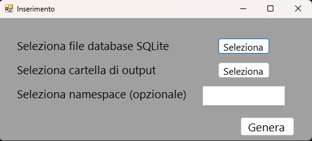
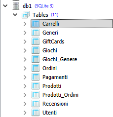
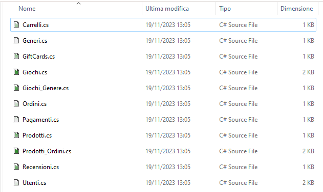
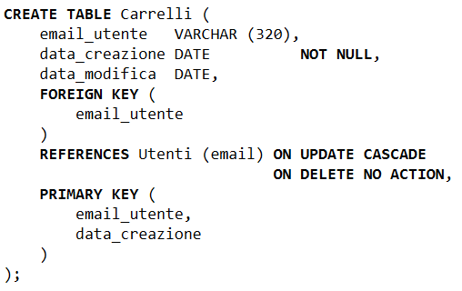
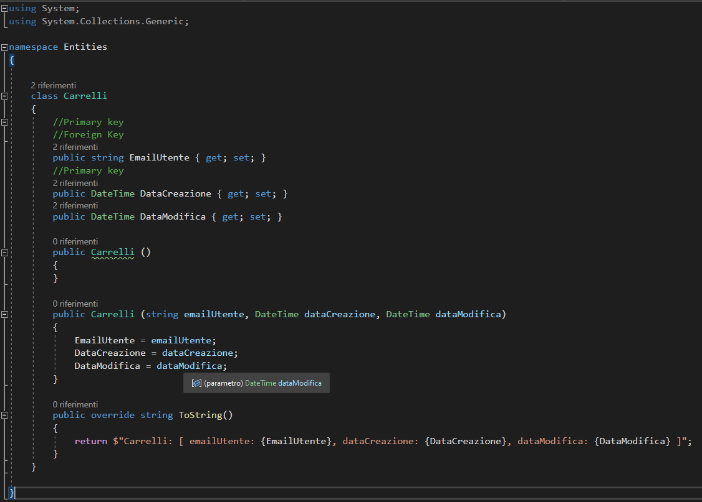

###  Italiano:

# SQLiteToCSharpEntitiesMapper

**Descrizione:**

SQLiteToCSharpEntitiesMapper è uno strumento in C# che consente di generare automaticamente classi C# a partire da uno schema di database SQLite. Questo tool semplifica notevolmente il processo di creazione delle classi rappresentative dei dati presenti nel database SQLite, fornendo una solida base per lo sviluppo di applicazioni in C#.

**Funzionalità principali:**

- Estrazione Automatica delle Classi: Genera automaticamente classi C# corrispondenti alle tabelle presenti nel database SQLite.
- Mappatura dei Tipi di Dati: Effettua una mappatura intelligente dei tipi di dati SQLite ai corrispondenti tipi di dati in C#.
- Dettagli dello Schema: Fornisce dettagliate informazioni sullo schema del database, inclusi nomi delle tabelle, colonne e vincoli.

**Utilizzo:**

1. Configurazione del Percorso del Database: Assicurati di specificare il percorso corretto del database SQLite nel codice sorgente.
2. Esecuzione: Avvia l'applicazione e il tool eseguirà l'estrazione delle informazioni dal database specificato.
3. Generazione delle Classi C#: Le classi C# generate saranno disponibili nella directory specificata.

#### Immagini (:it:):

1. **Inserimento:** Schermata di inserimento dei dati nel database.

2. **Successo:** Schermata di successo dopo la generazione dei file.

3. **Struttura del Database:** Vista delle tabelle nel database.

4. **Struttura del Mapping:** Visualizzazione dei file generati.

5. **Esempio Tabella (Carrelli):** Rappresentazione di una tabella nel database.

6. **Mapping Tabella (Carrelli):** Codice C# generato per la tabella "Carrelli".

---

###  English:

# SQLiteToCSharpEntitiesMapper

**Description:**

SQLiteToCSharpEntitiesMapper is a C# tool that automatically generates C# classes based on an SQLite database schema. This tool significantly streamlines the process of creating classes that represent the data within the SQLite database, providing a solid foundation for C# application development.

**Key Features:**

- Automatic Class Extraction: Automatically generates C# classes corresponding to tables in the SQLite database.
- Data Type Mapping: Intelligently maps SQLite data types to their corresponding C# data types.
- Schema Details: Provides detailed information about the database schema, including table names, columns, and constraints.

**Usage:**

1. Database Path Configuration: Ensure to specify the correct path to the SQLite database in the source code.
2. Execution: Run the application, and the tool will extract information from the specified database.
3. C# Class Generation: The generated C# classes will be available in the specified directory.

#### Images (🇬🇧):

1. **Insertion:** Data insertion screen into the database.

   

2. **Success:** Success screen after file generation.

   

3. **Database Structure:** View of the tables in the database.

   

4. **Mapping Structure:** Display of the generated files.

   

5. **Table Example (Carrelli):** Representation of a table in the database.

   

6. **Table Mapping (Carrelli):** Generated C# code for the "Carrelli" table.

   

---
